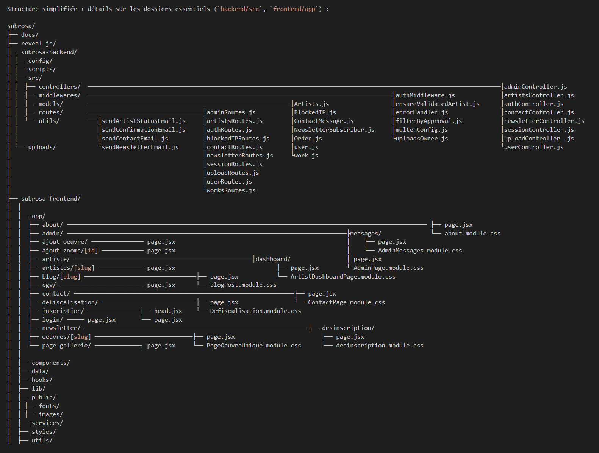
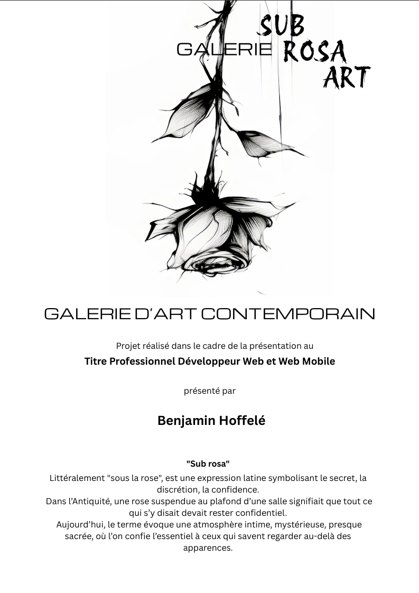

#  SUB ROSA ART

**Galerie d’art en ligne** — Projet personnel de Benjamin Hoffelé

SUB ROSA ART est une plateforme immersive de mise en relation entre artistes, collectionneurs, entreprises et amateurs d'art.  
Elle permet de découvrir, de visualiser et de contacter des artistes contemporains pour l'acquisition d'œuvres, sans passer par une vente directe.

---

## 📌 Fonctionnalités principales

### 🎨 Gestion des artistes
- Formulaire public d’inscription artiste avec upload de 3 images
- Statut `pending` pour validation manuelle par l’administrateur (avec email de notification)
- Création automatique d’un slug dynamique (`/artistes/[slug]`)
- Page artiste solo : portrait, biographie, œuvres associées
- Dashboard dédié aux artistes validés

### 🖼️ Gestion des œuvres
- Ajout d’œuvres par artistes connectés (même non validés mais avec limitation)
- Statut `pending` pour validation admin
- Upload multi-images avec descriptions
- Champs complets : médium, dimensions, thèmes, couleur dominante, type, prix, stock, etc.
- Galerie publique filtrable (Peinture, Photographie, Sculpture etc.)

### 🔒 Authentification et rôles
- Gestion des rôles : `admin`, `artist`, `user`
- Sessions sécurisées via `express-session`
- Redirections dynamiques selon le rôle
- Middleware de protection des routes

### 🛒 Mise en relation & navigation
- Système de mise en relation (pas de vente directe pour le moment)
- Service d’essai des œuvres (avec retour possible)
- Mises en avant, newsletters, suggestions d’œuvres
- Barre de navigation intelligente et responsive

### 📰 Blog
- Système d’articles dynamiques avec slug (`/blog/[slug]`)
- Affichage latéral de miniatures cliquables
- Bouton "Lire la suite", bouton "Voir tous les articles"
- Intégration de textes, images, et effets CSS visuels

### 📨 Newsletter
- Formulaire d’inscription à la newsletter
- Email de bienvenue automatique
- Lien de désinscription
- Protection contre doublons et IP abusives

### 🧮 Espace d’administration
- Validation ou rejet des status "pending" 
- Suppression -  artistes / œuvres
- Modification des infos enregistrées pour les artistes
- Affichage des statistiques (camemberts, histogrammes)
- Gestion des messages - Marqué LU/NON LU, repondre, supprimer, bloquer IP

### ⚙️ Sécurité & robustesse

- ✅ **Upload sécurisé** via `Multer`, avec restrictions sur le type de fichiers acceptés et le dossier cible `/uploads`
- 🔒 **Protection contre le spam** et les abus :
  - `express-rate-limit` sur le formulaire d'inscription des artistes (limité à 5 essais/heure en production)
  - Blocage des IP suspectes en base (prévu)
- 🔐 **Authentification renforcée** :
  - Sessions gérées via `express-session` avec cookies `httpOnly`
  - Détection et redirection selon les rôles (`admin`, `artist`, `user`)
  - Accès frontend conditionné selon le statut de l’utilisateur
- 🧮 **Validation multi-niveaux** :
  - Vérifications côté frontend (champs requis, formats, longueurs)
  - Vérifications côté backend (schémas Mongoose, regex, etc.)
- 📁 **Sécurisation des données** :
  - Pas de mot de passe en clair (hash avec `bcrypt`)
  - Fichier `.env` jamais versionné (`.gitignore`)
  - Séparation des secrets (email, MongoDB URI, clés Stripe, etc.)
- 🧱 **Protection de l’architecture** :
  - Middlewares de rôle : accès uniquement autorisé aux routes spécifiques (`isAdmin`, `isArtist`, etc.)
  - Vérification des droits avant toute action (modification, suppression)
- 🧰 **Sécurité anticipée pour la production** :
  - Headers HTTP sécurisés avec `helmet` (prévu)
  - Validation des emails (newsletter, inscriptions)
  - 🔜 **Suppression des routes non utilisées** à venir (en cours de refactoring)


### 🎯 Accessibilité et UX
- Navigation fluide, animations douces
- Responsive complet desktop / tablette / mobile
- Affichage conditionnel des boutons selon rôle
- Design aéré, typographies élégantes, effets d’apparition


---

## 🛠️ Technologies utilisées

### Frontend (📦 subrosa-frontend)
- **Next.js 13+** avec App Router (`/app`)
- **React** + composants dynamiques (`useEffect`, `useContext`, etc.)
- **CSS Modules** pour chaque composant ou page
- **Font Awesome** (icônes responsives personnalisées)
- **Fetch API** sécurisée (`credentials: include`)
- **Images optimisées** depuis `public/` (mise en page contrôlée)
- **Gestion des slugs** dynamiques avec `[slug].jsx`
- **Gestion des rôles frontend** (redirection et protection)
- **Effets CSS** (galerie, blog, animations d’apparition)

### Backend (📦 `subrosa-backend`)
- **Node.js** (LTS) + **Express.js**
- **MongoDB** (Atlas) via **Mongoose**
- **Multer** : upload d’images `.jpg`, `.jpeg`, `.png`, `.svg` (stockage local `/uploads`)
- **Express-session** : gestion des sessions (admin, artiste)
- **bcrypt** : hachage des mots de passe
- **Express-rate-limit** : limitation du nombre de requêtes
- **Express-validator** : validation des champs côté serveur
- **Nodemailer** : envoi d’emails (validation, newsletter)
- **Axios** : communication sécurisée entre frontend et backend
- **Cors** : autorisation des échanges inter-domaines
- **Cookie-parser** : gestion des cookies `httpOnly`
- **Dotenv** : variables d’environnement sécurisées
- **Nodemon** : redémarrage automatique en développement
- **Slugify** : génération de slugs lisibles depuis des chaînes
- **Body-parser** : traitement des données `POST`, `PUT`
- **Path**, **Fs** : gestion de fichiers, renommage, accès système
- **Helmet** (prévu) : sécurisation des headers HTTP
- **Architecture MVC** : `controllers`, `routes`, `models`, `middlewares`, `utils`

### Fonctionnalités côté serveur
- 🔁 **API REST complète** : artistes, œuvres, utilisateurs, messages
- 🔐 **Authentification différenciée** : `admin`, `artist`, `user`
- 🧱 **Protection des routes** : middlewares (`isAdmin`, `isArtist`, `isAuthenticated`)
- 📂 **Upload avancé** : renommage, vérification MIME, enregistrement DB
- 🎯 **Gestion des statuts** : `pending`, `validated`, `rejected` pour artistes et œuvres
- 📬 **Formulaire contact** : enregistrement, recherche, suppression, blocage IP
- 📊 **Tableaux de bord** : statistiques (total œuvres, artistes, newsletter, en attente)

### Sécurité & Bonnes pratiques
- 🔐 Séparation des rôles (`admin`, `artist`, `user`)
- 🧱 Middleware par type de rôle
- 🛡️ Sécurisation des routes sensibles
- 🧮 Validation frontend et backend des données
- 🚫 Pas de données sensibles stockées en clair
- 📁 `.env` ignoré (`non versionné` via `.gitignore`)
- 🔒 Cookies `httpOnly` + redirection par rôle
- 🧰 Suppression des routes inutilisées (prévu)
- 🧠 Protection anti-flood : limitation des formulaires

### Outils de développement
- **Postman** (test des routes API)
- **MongoDB Compass** (visualisation de la base)
- **GitHub + Issues + Branches** (workflow pro)
- **Reveal.js** (présentation orale de soutenance)


---

## 📁 Structure du projet

Structure simplifiée + détails sur les dossiers essentiels (`backend/src`, `frontend/app`) :



## 🚀 Lancer le projet localement

### Prérequis :
- Node.js v18+
- MongoDB local ou distant
- `npm` ou `yarn`

### 📦 Installation

```bash
# 1. Cloner le repo
git clone https://github.com/benhartdev/subrosa.git
cd subrosa

# 2. Installer le backend
cd subrosa-backend
npm install

# 4. Lancer le backend
npm run dev

# 3. Installer le frontend
cd ../subrosa-frontend
npm install

# 3. Lancer le frontend
npm run dev

```

## 🛠️ Configuration de l'environnement (.env)

Pour faire fonctionner le projet en local, vous devez créer un fichier .env à la racine du dossier subrosa-backend.

Ce fichier contient toutes les variables d’environnement nécessaires au bon fonctionnement du backend.
Un fichier exemple est fourni : .env.example

Ensuite, remplace les valeurs génériques par tes vraies informations confidentielles.

⚠️ **Ne jamais pousser ton fichier `.env` sur GitHub**. Il est déjà ignoré via `.gitignore`.


## 📜 Prérequis

Avant de démarrer le projet en local, vous devez :

    Avoir Node.js LTS et npm installés

    Avoir accès à une base de données MongoDB (locale ou distante via MongoDB Atlas)

    Créer un fichier .env dans le dossier subrosa-backend à partir de .env.example

    Ne pas oublier d’autoriser votre IP dans MongoDB Atlas si vous êtes en hébergement distant


   ##  👮 Droits d’auteur & distribution

Ce projet est la propriété exclusive de Benjamin Hoffelé, développeur et auteur du concept SUB ROSA ART.

    📌 Aucun choix de licence open source n’a été effectué à ce stade, le projet étant personnel et encore en développement.

    🔒 Toute utilisation, diffusion ou reproduction partielle ou totale sans autorisation est strictement interdite.

    🎨 Cependant, une partie des composants UI (effets de survol artistiques, éléments graphiques) seront publiés sur CodePen dans un esprit de partage et d’inspiration.

    🧾 Toute tentative de clonage ou d’exploitation commerciale sans autorisation fera l’objet de poursuites.


## 📄 Présentation de soutenance

    📄 [Télécharger le dossier de présentation au format PDF](./docs/SUB-ROSA-ART-by-Benjamin-Hoffelé.pdf)

"Vous pouvez le télécharger et l’ouvrir dans un lecteur PDF classique, ou le visionner via vscode en installant l'extension "vscode-pdf" de tomoki1207."

Voici un aperçu du document de soutenance (cliquez pour télécharger le PDF complet) :

## 📁 Structure du projet




#### ✅ 4. **Crédits / Auteur / Licence**


### 👤 Benjamin Hoffelé (BenHartDev)

Projet réalisé par Benjamin Hoffelé dans le cadre du titre professionnel de Développeur Web/Web Mobile.

### ⚖️ Licence

Ce projet est protégé par les droits d’auteur © SUB ROSA ART – 2025.
Reproduction interdite sans accord préalable.
